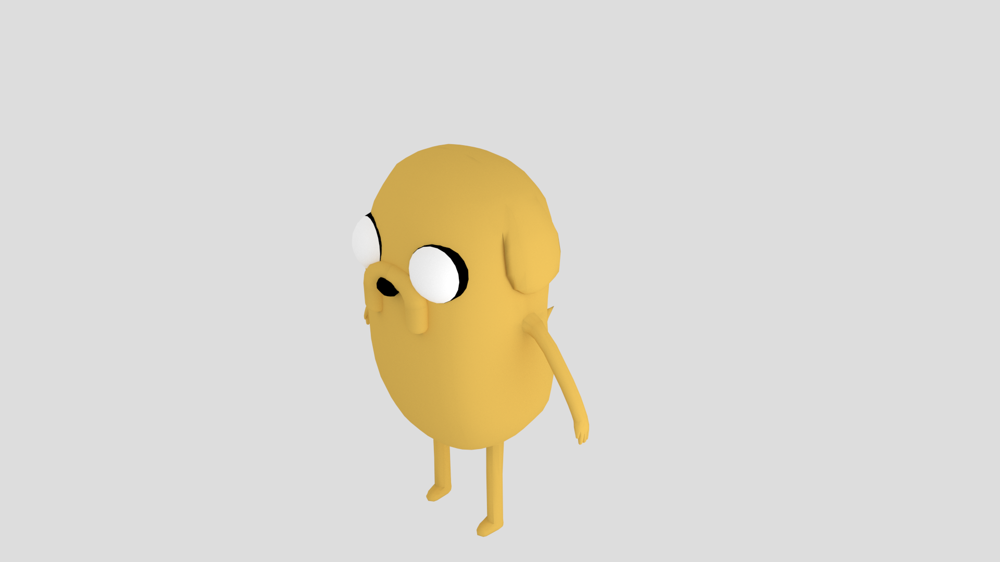
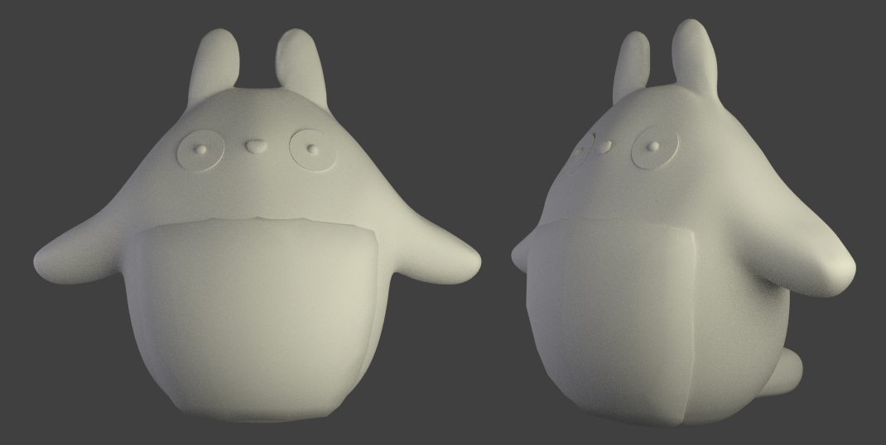

blendifyMe
==========

Blender 3D models and output.

<h2> Hachiroku </h2>
Also known as the Toyota AE86, Hachiroku is Japanese for “eight-six”. I attempted to make a low polygon count version of the car. It has approximately 2,000 vertices and 3,700 triangles.

<h2> Jake the Dog </h2>

<h2> Totoro </h2>

Model was 3D printed at HackRU on April 13th around 2 in the morning. Totoro_Final.blend is 3D-printer ready. It has 1.5mm thickness and is aproximately X:4.4cm Y: 3.5cm Z: 3.9cm. 

